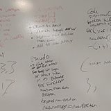
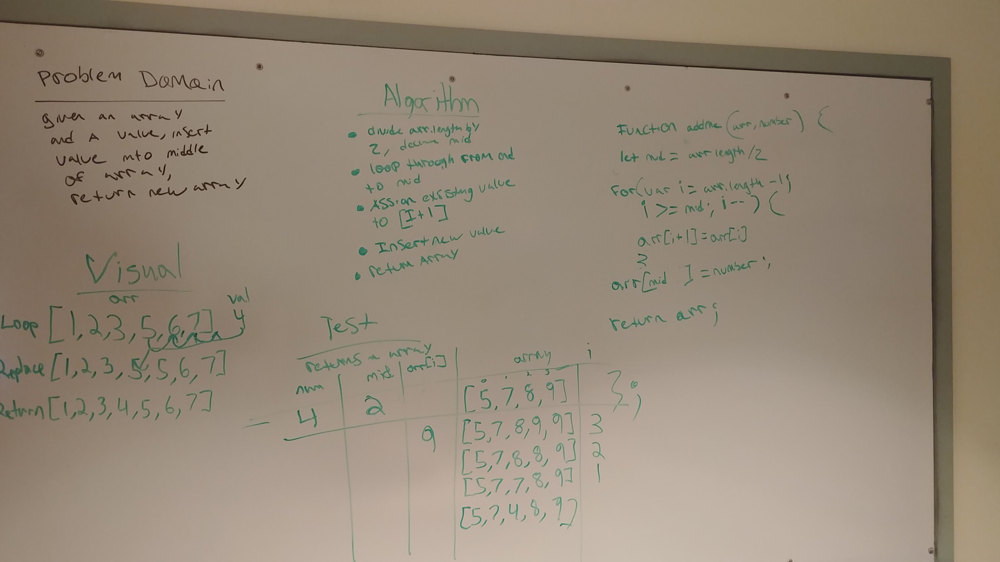
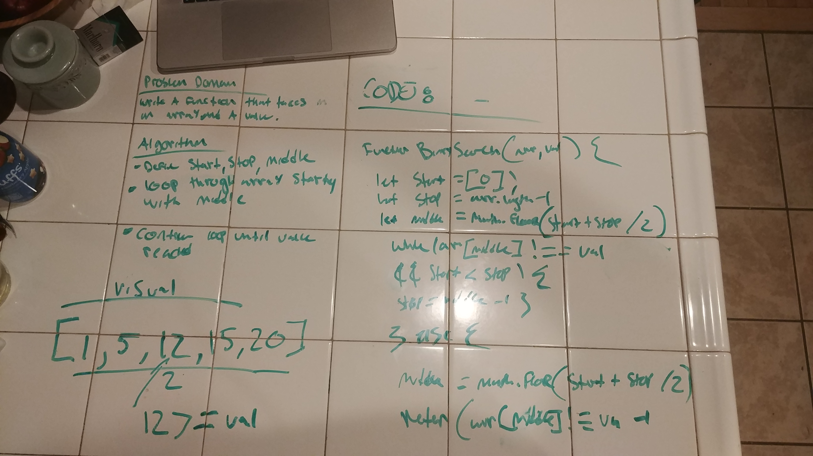
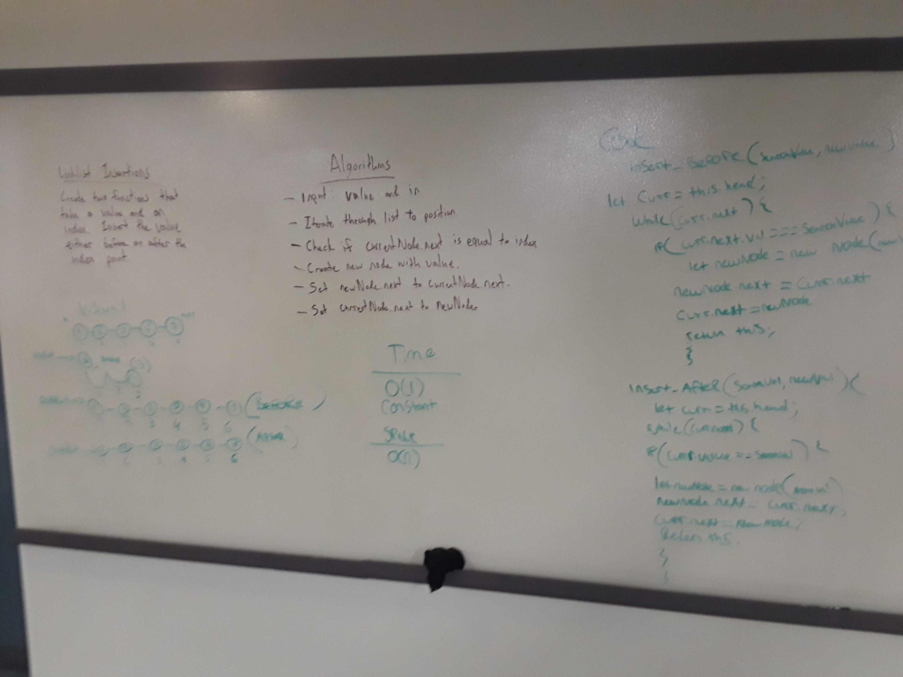
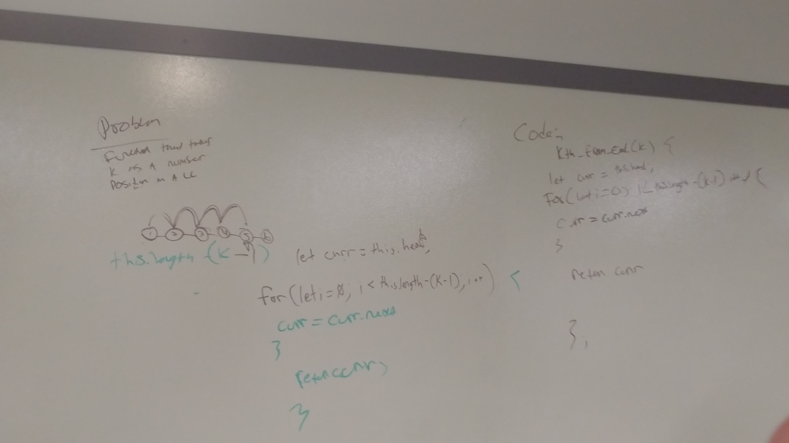
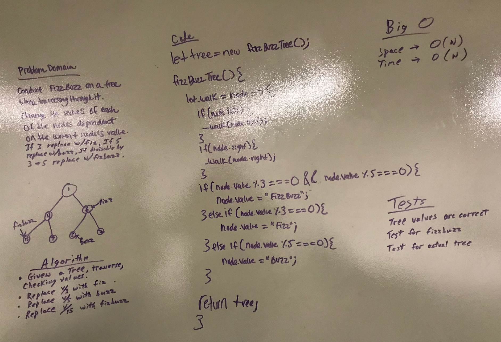

# reverse an array
The object of this challenge to write a function that does not use and built in methods and that  

## Challenge 
Write a function called reverseArray which takes an array as an argument. Without utilizing any of the built-in methods available to your language, return the provided array argument with elements in reversed order.

## Solution 

# shift an array

## challenge
write a function that takes in a value and inserts it into the center position of an array with out using built in methods

## solution

 # Binary Search an array

 ## challenge
 write a function thast take in an array and a value and uses a binary search method to locate the value within the array. 

 ## solution 
 

# Insert Before and After in a linked List 

## challenge
write a function that takes in a new value which can be inserted before or after a given search value

## solution

# kth from end

## challenge
write a function that adds a value in a numbered position from the end of the linked list

## solution

# FIZZ BUZZ TREE

## challenge 
use a breadth first search in a binary tree

## contributors
Ashley and Edd and me

## solution

